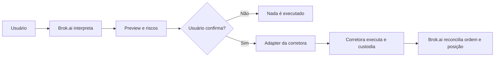

# Brok.ai — Memorando de visão, modelo de negócio e expansão global

**Versão:** 1.0  
**Data de referência:** 19 de julho de 2026  
**Estado atual:** MVP funcional de paper trading; nenhuma ordem real é enviada

## 1. Resumo executivo

Brok.ai pretende ser um **terminal inteligente global multibroker**, e não uma corretora. O usuário conecta uma conta que já possui em uma corretora ou exchange compatível. A Brok.ai interpreta a intenção em linguagem natural, resolve o ativo, calcula o impacto da ordem, apresenta um preview e, somente após confirmação explícita, transmite a ordem à API da instituição escolhida.

A corretora permanece responsável por cadastro, custódia, saldo, suitability, execução, liquidação e documentos oficiais. A Brok.ai atua como camada de software para comando, normalização, acompanhamento, risco e auditoria.

> **Princípio central:** a Brok.ai não recebe depósitos, não mantém saldo, não custodia ativos e nunca solicita permissão de saque ou transferência.

## 2. Proposta de valor

O usuário não deveria precisar aprender interfaces, símbolos e fluxos diferentes para cada instituição. A Brok.ai oferece uma experiência única para múltiplas corretoras e classes de ativos.

Exemplos de solicitações:

- “Compre US$ 1.000 de Apple a mercado.”
- “Abra uma posição short no S&P 500 com 1% do caixa.”
- “Reduza minha posição em PayPal em 50%.”
- “Compre 10% do caixa em petróleo e coloque stop de 5%.”
- “Mostre o risco agregado das posições abertas em todas as corretoras.”

O diferencial não é apenas utilizar um LLM. O valor defensável está em:

- interpretação confiável da intenção;
- resolução correta do instrumento;
- normalização multibroker;
- preview determinístico;
- confirmação humana obrigatória;
- controles de risco e prevenção de ordens duplicadas;
- reconciliação com a fonte oficial da corretora;
- trilha completa de auditoria.

## 3. Papel da Brok.ai e da corretora



### Responsabilidades da Brok.ai

- interpretar texto, voz ou formulário;
- transformar a intenção em uma ordem canônica;
- identificar ticker, bolsa, moeda e instrumento;
- mostrar preço indicativo, tamanho, custos e impacto no portfólio;
- exigir confirmação explícita;
- transmitir ou cancelar ordens autorizadas;
- acompanhar status, fills, posições e risco;
- registrar texto original, JSON interpretado, preview, confirmação e resposta da corretora.

### Responsabilidades da corretora

- onboarding, KYC e prevenção à lavagem de dinheiro;
- suitability e restrições da conta;
- custódia de dinheiro e ativos;
- disponibilidade de margem e aluguel;
- roteamento, execução e liquidação;
- confirmação oficial, extratos e documentos fiscais;
- controles e obrigações regulatórias atribuídos ao intermediário.

## 4. Arquitetura de conexão

Devem existir dois modos de conexão.

### 4.1 OAuth — modo preferencial

O usuário é redirecionado para a própria corretora, autentica-se nela e concede escopos específicos à Brok.ai. A Brok.ai recebe um token revogável, sem conhecer a senha do usuário.

Escopos mínimos:

- leitura da conta;
- leitura de posições, ordens e fills;
- criação e cancelamento de ordens.

Nunca solicitar escopos de saque, transferência ou alteração cadastral.

### 4.2 Conector local — fallback para API keys

Quando não existir OAuth, a chave pode permanecer criptografada no dispositivo do usuário. Um pequeno serviço local recebe da Brok.ai uma intenção assinada, valida a confirmação e chama diretamente a API da corretora.

Esse modo reduz a exposição centralizada de credenciais, mas depende de o dispositivo estar ligado para ordens agendadas e monitoramento contínuo.

### 4.3 Isolamento do LLM

Tokens, secrets e API keys nunca entram no prompt, no log do modelo ou no contexto do Ollama. O modelo produz somente uma intenção estruturada. Validação, cálculo financeiro, autorização e envio pertencem a código determinístico.

## 5. Padrão multibroker

Todas as integrações devem implementar uma interface canônica semelhante a:

```ts
interface BrokerAdapter {
  connect(): Promise<Connection>;
  getCapabilities(): Promise<BrokerCapabilities>;
  getAccount(): Promise<Account>;
  getPositions(): Promise<Position[]>;
  getOrders(): Promise<Order[]>;
  previewOrder(order: CanonicalOrder): Promise<OrderPreview>;
  submitOrder(order: CanonicalOrder): Promise<Execution>;
  cancelOrder(id: string): Promise<void>;
}
```

Cada adapter deve declarar suas capacidades:

- países e contas atendidas;
- ações, ETFs, opções, futuros, câmbio ou cripto;
- ordens market, limit, stop, stop-limit, OCO e bracket;
- posições long e short;
- ativos fracionários;
- negociação estendida;
- moedas-base;
- dados de mercado disponíveis;
- limites, rate limits e requisitos de autenticação.

A interface deve bloquear ou explicar operações que a corretora não suporta, em vez de tentar aproximá-las silenciosamente.

## 6. Estratégia de integrações

### Etapa 1 — Alpaca Paper e Connect

Primeiro candidato para validar OAuth, sincronização de conta e ordens em ambiente paper. O Alpaca Connect permite que fintechs e desenvolvedores conectem contas por OAuth. Ordens live dependem de registro, revisão e aprovação do aplicativo.

### Etapa 2 — Binance Testnet e Spot

Valida criptomoedas, símbolos Binance, precisão de quantidades e permissões distintas de leitura e negociação. Chaves devem possuir somente `TRADE` e `USER_DATA`, nunca saque.

### Etapa 3 — Interactive Brokers

Oferece ampla cobertura internacional. O acesso para aplicações terceirizadas exige processo de onboarding e aprovação de compliance, além de entidade e presença pública estabelecidas.

### Etapas posteriores

- Coinbase e Kraken;
- corretoras europeias e asiáticas com OAuth oficial;
- corretoras regionais escolhidas a partir da demanda real dos usuários;
- provedores de embedded brokerage quando agregarem cobertura ou simplificarem compliance.

## 7. Estratégia global

“Global” não significa habilitar ordens reais simultaneamente em todos os países. A arquitetura e a marca podem nascer globais, mas a execução deve ser liberada por combinação de:

- país de residência;
- corretora utilizada;
- entidade regulada responsável;
- classe de ativo;
- bolsa e moeda;
- permissões da conta;
- regras locais de oferta, transmissão e execução.

A Brok.ai deve manter uma matriz de disponibilidade e usar feature flags. Quando uma integração não estiver habilitada em determinada jurisdição, o usuário continua podendo utilizar paper trading, acompanhamento e análise, sem transmissão de ordens.

Também serão necessários:

- internacionalização de idioma, números e moedas;
- calendários, feriados e fusos de cada mercado;
- política de privacidade e retenção por região;
- controles de proteção de dados;
- termos específicos para cada integração;
- registro das versões de termos, consentimentos e confirmações.

## 8. Enquadramento regulatório

Não custodiar recursos reduz muito o risco operacional, mas não elimina automaticamente o risco regulatório. Autoridades analisam o fluxo real do produto, e não apenas sua descrição comercial.

Pontos que aumentam o risco de enquadramento:

- receber e transmitir ordens profissionalmente;
- escolher o ativo ou recomendar uma transação personalizada;
- operar discricionariamente sem confirmação específica;
- receber remuneração vinculada ao valor, resultado ou quantidade de transações;
- controlar credenciais, dinheiro ou ativos do usuário;
- apresentar-se como corretora, consultor ou gestor.

Na União Europeia, o MiCA inclui “recepção e transmissão de ordens” entre os serviços de criptoativos. Nos Estados Unidos, remuneração baseada em transações é um forte indicador de atividade de broker-dealer. No Brasil, intermediação e execução de ordens de valores mobiliários são atividades típicas de intermediários autorizados.

Por isso, antes de ordens reais, a Brok.ai deverá obter parecer jurídico específico para cada mercado prioritário e validar contratualmente o modelo com cada corretora.

## 9. Modelo de negócio recomendado

O produto básico pode permanecer gratuito para o usuário. A monetização prioritária deve ser **B2B2C**, com pagamento pelas instituições que se beneficiam da interface e do fluxo de clientes.

Fontes possíveis de receita:

1. licenciamento para corretoras;
2. white-label para bancos, exchanges e instituições financeiras;
3. fee de tecnologia por conta conectada ou ativa, pago pelo parceiro;
4. implantação e manutenção de adapters privados;
5. revenue share formalizado dentro da estrutura regulatória da corretora;
6. API profissional para plataformas autorizadas.

### Fee por ordem

A Brok.ai não deve começar cobrando diretamente do usuário por ordem. Esse formato:

- pode reforçar o enquadramento como intermediário;
- cria incentivo econômico para estimular operações;
- compete com a expectativa de corretagem zero;
- complica a expansão internacional.

Se futuramente existir uma tarifa transacional, a opção preferencial é que ela seja contratada, apresentada e liquidada pela corretora parceira, com divulgação clara no preview e validação jurídica na jurisdição do cliente.

## 10. Controles obrigatórios para dinheiro real

- preview obrigatório antes de toda nova ordem;
- confirmação explícita e específica;
- idempotency key para impedir duplicidade;
- expiração curta do preview;
- revalidação de preço, saldo, posição e capacidade da corretora;
- limites por ordem, dia, ativo e classe;
- bloqueio de saque e transferência;
- kill switch global e por conta;
- reconciliação periódica com a corretora;
- registro imutável da intenção e da resposta;
- indicação clara de dados atrasados ou indisponíveis;
- tratamento explícito de partial fills, rejeições e mercados fechados;
- nenhuma decisão autônoma baseada apenas na saída do LLM.

## 11. Roadmap de produto e negócio

### Fase 1 — Paper trading público

- publicar uma demo segura;
- medir ativação, retenção e ordens simuladas;
- identificar brokers, países e ativos mais solicitados;
- acompanhar taxa de interpretação correta e abandono no preview.

### Fase 2 — Núcleo multibroker

- consolidar `CanonicalOrder` e `BrokerAdapter`;
- criar matriz de capabilities;
- separar portfólios e credenciais por usuário;
- implementar OAuth e cofre de tokens;
- reforçar auditoria e idempotência.

### Fase 3 — Integrações paper

- Alpaca Paper;
- Binance Testnet;
- sincronização de posições e ordens externas;
- testes de reconciliação e falhas de rede.

### Fase 4 — Parceiros e compliance

- constituir entidade jurídica;
- publicar documentação e políticas;
- iniciar onboarding com corretoras;
- contratar parecer jurídico nas primeiras jurisdições;
- definir contratos, responsabilidades e remuneração.

### Fase 5 — Execução real controlada

- grupo pequeno de usuários;
- limites conservadores;
- observabilidade e suporte operacional;
- revisão manual de incidentes;
- expansão por broker e país somente após evidência de segurança.

## 12. Métricas essenciais

- usuários que conectam uma conta;
- usuários que geram e confirmam previews;
- ordens interpretadas corretamente;
- correções manuais antes da confirmação;
- ordens rejeitadas, duplicadas ou reconciliadas incorretamente;
- tempo entre intenção e preview;
- ativos e corretoras mais solicitados;
- retenção semanal e mensal;
- receita por conta conectada;
- custo de dados, infraestrutura e suporte por usuário;
- incidentes de segurança ou permissões excessivas.

## 13. Posicionamento

> **Brok.ai é a interface inteligente que conecta investidores às corretoras que eles já utilizam, traduzindo linguagem natural em ordens seguras, verificáveis e confirmadas.**

A Brok.ai não compete pela custódia. Ela compete pela melhor experiência de decisão, comando e acompanhamento entre múltiplas instituições.

## 14. Decisões registradas

- Brok.ai não pretende se tornar corretora.
- O usuário continuará cliente direto da corretora escolhida.
- A corretora será sempre a fonte oficial de saldo, posição e execução.
- O produto será construído para alcance global, com liberação gradual por jurisdição.
- OAuth será preferido; API keys utilizarão escopo mínimo e, idealmente, conector local.
- Preview e confirmação permanecerão obrigatórios.
- Monetização prioritária será B2B2C, não assinatura obrigatória do usuário.
- Fee direto por ordem não será adotado antes de parceria e análise regulatória.

## 15. Referências oficiais iniciais

- [Alpaca Connect API](https://docs.alpaca.markets/us/docs/about-connect-api)
- [Alpaca OAuth e Trading API](https://docs.alpaca.markets/us/docs/using-oauth2-and-trading-api)
- [Interactive Brokers Web API](https://www.interactivebrokers.com/campus/ibkr-api-page/webapi-doc/)
- [Binance Spot API — segurança e permissões](https://developers.binance.com/en/docs/products/spot/rest-api)
- [CVM — Corretoras e distribuidoras](https://www.gov.br/cvm/pt-br/assuntos/regulados/consultas-por-participante/corretoras-e-distribuidoras)
- [SEC — Guide to Broker-Dealer Registration](https://www.sec.gov/about/divisions-offices/division-trading-markets/division-trading-markets-compliance-guides/guide-broker-dealer-registration)
- [ESMA — definições do MiCA](https://www.esma.europa.eu/publications-and-data/interactive-single-rulebook/mica/article-3-definitions)
- [ESMA — autorização de prestadores de serviços de criptoativos](https://www.esma.europa.eu/publications-and-data/interactive-single-rulebook/mica/article-59-authorisation)

---

Este memorando registra uma direção estratégica e técnica. Não constitui parecer jurídico, regulatório, fiscal ou recomendação de investimento.
