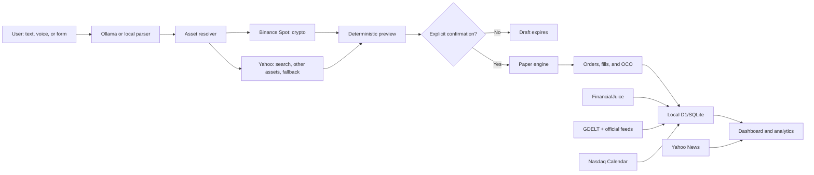

# Brok.ai Technical Memo And AI-Agent Guide

**Document version:** 1.0
**Reference date:** July 22, 2026
**Product state:** functional local paper-trading MVP
**Project directory:** `/Users/gustavomedeiros/Desktop/brok_ai`

## 1. Executive Summary

Brok.ai is a local-first paper trading terminal. The user describes an order in natural language, dictates it by voice, or fills a manual form. The system interprets the request, resolves the asset, fetches a quote, calculates a deterministic preview, and requires explicit confirmation before recording a simulated order.

The product tracks cash, long and short positions, market/limit/stop orders, fills, P&L, exposure, risk, equity curve, history, news, and economic-calendar events. Financial records are stored in the local D1/SQLite database.

> **Main invariant:** Brok.ai is not a broker and does not send real orders in the current MVP. The Alpaca adapter is disabled. No change may remove the mandatory preview and confirmation step.

## 2. Product Capabilities

- interprets plain-English trading instructions with local Ollama;
- uses a deterministic parser as fallback when Ollama is unavailable or returns invalid data;
- resolves companies, tickers, cryptocurrencies, and investment themes;
- accepts Yahoo symbols (`BTC-USD`) and Binance symbols (`BTCUSDT`, `BTC-USDT`, `BTC/USDT`);
- suggests related instruments, usually ETFs, when a direct asset does not exist for a theme;
- simulates long and short positions;
- accepts sizing by shares, USD notional, percent of available cash, or percent of an existing position;
- supports market, limit, and stop orders;
- creates linked stop-loss and take-profit orders through OCO groups;
- allows reducing 25%, reducing 50%, or closing a position;
- records orders, fills, cash ledger entries, snapshots, and audit events;
- calculates realized and unrealized P&L, allocation, drawdown, concentration, stop risk, volatility, correlation, beta, and scenarios;
- shows per-position detail with price history, performance, risk, execution, and news;
- links each position to its TradingView chart;
- supports local microphone dictation through Whisper;
- combines FinancialJuice, GDELT, official feeds, Yahoo, and Nasdaq for news and calendar data;
- reconstructs missing snapshot periods after the Mac wakes up or reconnects to the internet.

## 3. What The Product Does Not Do

- it does not send orders to a broker;
- it does not move real money;
- it does not provide investment advice;
- it does not guarantee quality, availability, or real-time delivery from free data sources;
- it does not require a remote server;
- it does not use the LLM for financial calculations or fill decisions;
- it does not provide multi-user authentication;
- it does not automatically apply dividends and splits from a live corporate-actions feed;
- it does not currently provide operational Alpaca execution.

## 4. Architecture



| Layer | Responsibility | Main files |
|---|---|---|
| Interface | terminal UI, forms, previews, charts, navigation | `app/page.tsx`, `app/globals.css`, `app/components/position-detail-drawer.tsx` |
| Local API | HTTP boundary between UI and domain logic | `app/api/**/route.ts` |
| Financial engine | validation, drafts, confirmation, fills, OCO, cash, snapshots | `lib/trading-engine.ts`, `lib/finance.ts` |
| Market data | symbol resolution, normalization, quotes, candles | `lib/market-data.ts` |
| Analytics | performance, benchmark, risk, alerts | `lib/analytics.ts` |
| Position detail | individual position view, news, chart links | `lib/position-detail.ts`, `lib/position-detail-math.ts` |
| Offline history | gap detection and reconstruction | `lib/portfolio-history.ts`, `lib/time-series.ts` |
| Intelligence | news and economic-calendar ingestion | `lib/market-intelligence.ts`, `lib/market-intelligence-normalize.ts`, `lib/open-news-sources.ts`, `lib/nasdaq-economic-calendar.ts` |
| Persistence | local D1/SQLite and idempotent initialization | `db/index.ts`, `db/schema.ts`, `drizzle/` |
| Runtime | Next/React on vinext, Vite, and local Cloudflare runtime | `vite.config.ts`, `worker/index.ts` |
| macOS services | daily server, collector, and Whisper helpers | `scripts/` |

## 5. Order Lifecycle

1. The user types, dictates, or manually enters an intent.
2. `POST /api/chat` tries to obtain structured JSON from local Ollama at `127.0.0.1:11434`.
3. If Ollama is unavailable or invalid, `parseIntentWithRules()` handles the request.
4. The resolver queries Binance/Yahoo and standardizes the symbol.
5. `POST /api/drafts` normalizes and validates the intent.
6. The engine fetches quote, position, and cash data, then calculates size, notional, and protections.
7. A five-minute `PENDING` draft is persisted with its preview.
8. The UI displays the preview. Nothing has executed yet.
9. `POST /api/drafts/confirm` recalculates the preview with current data.
10. A market order is rejected if the quote moved more than 1% since preview.
11. A confirmed order is created and checked for fill.
12. Market orders execute immediately in the simulator; limit/stop orders remain pending until triggered.
13. A fill changes the cash ledger and the derived position.
14. Stop-loss and take-profit protections are created as OCO siblings.
15. When one OCO leg executes, the sibling is cancelled.
16. The engine reconciles protective quantities and records an equity snapshot.

## 6. LLM Safety Boundary

The default local model is `qwen3.5:9b` through Ollama. Temperature is zero, output follows a JSON schema, and required fields can be repaired with deterministic parser data.

The LLM only translates natural language into structured intent. It never:

- calculates quantity, cash, P&L, or fills;
- decides whether an order can execute;
- bypasses price, cash, or risk validation;
- bypasses confirmation.

After the LLM step, all fields go through deterministic normalization and engine validation.

## 7. Market Date

Yahoo Finance is used for search, non-crypto assets, fallback quotes, historical bars, portfolio ticker news, and theme alternatives. Binance Spot is preferred for crypto assets with public USDT pairs and requires no API key.

Internal portfolio symbols use the Yahoo-style `BASE-USD` pattern even when the live quote comes from Binance. The actual source is recorded as `BINANCE_SPOT`. If Binance cannot serve the pair, the hybrid provider falls back to Yahoo.

`roundPriceCents()` preserves sub-cent precision. Do not replace it with `Math.round(price * 100)`, because that would turn low-priced crypto assets such as PEPE into zero.

## 8. Persistence And Accounting

The `DB` binding is a local D1 database running through Miniflare/Cloudflare. `ensureDatabase()` creates missing structures and seeds the initial US$100,000 paper deposit once.

Accounting principles:

- cash is the sum of `cash_ledger`;
- positions are reconstructed from immutable `fills`, not stored as mutable state;
- average cost is weighted;
- realized P&L is generated when a fill reduces or closes an existing position;
- equity is cash plus net position value;
- pending entry orders reserve cash;
- shorts reserve synthetic collateral equal to the absolute position value;
- current fills use zero fee and a default 5 bps simulated slippage.

## 9. Offline Reconstruction

The system does not interpolate invented prices. When it detects a gap longer than 15 minutes, it:

1. reads the last valid snapshot before the gap;
2. tries Binance for crypto and Yahoo for other assets;
3. uses only the latest known price at each reconstructed timestamp;
4. writes reconstructed rows as `MARKET_BACKFILL`;
5. leaves a visible chart gap when coverage is insufficient.

## 10. News And Calendar

FinancialJuice is the primary delayed stream when `FINANCIALJUICE_API_KEY` is configured. GDELT and official RSS/Atom feeds broaden market and geopolitical coverage. Yahoo provides ticker-specific fallback news for open positions. Nasdaq is used as a free economic-calendar fallback.

Only placeholders such as `your_financialjuice_api_key_here` may appear in committed files. Real API keys belong only in `.env.local`, local runtime variables, or hosted secret stores.

## 11. Daily Commands

```bash
npm install
npm run dev
npm run news:collect
npm run collector:install
npm run collector:uninstall
npm run voice:install
npm run voice:uninstall
npm run lint
npm test
```

## 12. Release Checklist

Before publishing or pushing changes:

1. run a secret scan excluding ignored runtime/build folders;
2. confirm `.env.local`, `dist`, `.wrangler`, `.paperdesk`, and `node_modules` are ignored;
3. run `npm run lint`;
4. run `npm test`;
5. keep preview and explicit confirmation mandatory;
6. update this memo when behavior changes.
