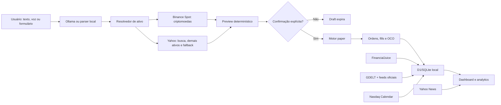

# Brok.ai — Memorando técnico e guia para agentes de IA

**Versão do documento:** 1.0  
**Data de referência:** 19 de julho de 2026  
**Estado do produto:** MVP local funcional de paper trading  
**Diretório do projeto:** `/Users/gustavomedeiros/Desktop/brok_ai`

## 1. Resumo executivo

Brok.ai é um terminal local de **paper trading**. O usuário descreve uma operação em linguagem natural ou preenche um formulário; o sistema interpreta o pedido, resolve o ativo, obtém uma cotação, calcula um preview determinístico e exige confirmação explícita antes de registrar a ordem simulada.

O produto acompanha caixa, posições long e short, ordens market/limit/stop, fills, P&L, exposição, risco, curva de patrimônio, histórico, notícias e calendário econômico. Todos os registros financeiros ficam no banco D1/SQLite local.

> **Invariante principal:** Brok.ai não é uma corretora e não envia ordens reais. O adapter Alpaca está desativado. Nenhuma alteração deve remover a etapa obrigatória de preview e confirmação.

## 2. O que o produto faz

- interpreta ordens em português com Ollama local;
- usa um parser determinístico como fallback quando o Ollama falha ou retorna dados inválidos;
- resolve empresas, tickers, criptomoedas e temas de investimento;
- aceita símbolos Yahoo (`BTC-USD`) e Binance (`BTCUSDT`, `BTC-USDT`, `BTC/USDT`);
- sugere ativos relacionados, normalmente ETFs, quando não existe um instrumento direto para um tema;
- simula posições long e short;
- aceita tamanho por unidades, valor em USD, percentual do caixa ou percentual da posição;
- aceita ordens market, limit e stop;
- cria stop-loss e take-profit vinculados em OCO;
- permite reduzir 25%, reduzir 50% ou fechar uma posição;
- registra ordens, fills, caixa, snapshots e auditoria;
- calcula P&L realizado e não realizado, alocação, drawdown, concentração, risco nos stops, volatilidade, correlação, beta e cenários;
- mostra detalhes individuais por posição, histórico de preço, performance, risco, execução e notícias;
- oferece link para o gráfico correspondente no TradingView;
- recebe ditado pelo microfone e transcreve localmente com Whisper;
- combina FinancialJuice, GDELT, fontes oficiais, Yahoo e Nasdaq para notícias e calendário;
- reconstrói períodos sem snapshots quando o Mac volta a funcionar e recupera os preços históricos.

## 3. O que o produto não faz

- não envia ordens a uma corretora;
- não movimenta dinheiro real;
- não oferece recomendação financeira;
- não garante qualidade, disponibilidade ou tempo real das fontes gratuitas;
- não mantém um servidor remoto obrigatório;
- não usa o LLM para fazer cálculos financeiros ou decidir fills;
- não possui autenticação multiusuário;
- não aplica automaticamente dividendos e splits vindos de um feed: eventos corporativos são cadastrados manualmente;
- não possui integração operacional com Alpaca. Existe somente um provider de cotação preparado e desativado na interface.

## 4. Arquitetura



### Camadas

| Camada | Responsabilidade | Arquivos principais |
|---|---|---|
| Interface | terminal, formulários, preview, gráficos e navegação | `app/page.tsx`, `app/globals.css`, `app/components/position-detail-drawer.tsx` |
| API local | fronteira HTTP entre UI e domínio | `app/api/**/route.ts` |
| Motor financeiro | validação, drafts, confirmação, fills, OCO, caixa e snapshots | `lib/trading-engine.ts`, `lib/finance.ts` |
| Dados de mercado | resolução, normalização, cotações e candles | `lib/market-data.ts` |
| Analytics | performance, benchmark, risco e alertas | `lib/analytics.ts` |
| Posição detalhada | visão individual, notícias e gráfico | `lib/position-detail.ts`, `lib/position-detail-math.ts` |
| Histórico offline | detecção de lacunas e reconstrução | `lib/portfolio-history.ts`, `lib/time-series.ts` |
| Inteligência | FinancialJuice, GDELT, feeds oficiais, Yahoo News e Nasdaq Calendar | `lib/market-intelligence.ts`, `lib/market-intelligence-normalize.ts`, `lib/open-news-sources.ts`, `lib/nasdaq-economic-calendar.ts` |
| Persistência | D1/SQLite local e inicialização idempotente | `db/index.ts`, `db/schema.ts`, `drizzle/` |
| Runtime | Next/React sobre vinext, Vite e Cloudflare local | `vite.config.ts`, `worker/index.ts` |
| Serviços macOS | servidor diário, coletor e Whisper | `scripts/` |

## 5. Fluxo completo de uma ordem

1. O usuário escreve, dita ou preenche uma intenção.
2. `POST /api/chat` tenta obter JSON estruturado do Ollama em `127.0.0.1:11434`.
3. Se o Ollama estiver indisponível ou inválido, `parseIntentWithRules()` assume o fluxo.
4. O resolvedor consulta Binance/Yahoo e padroniza o símbolo.
5. `POST /api/drafts` normaliza e valida a intenção.
6. O motor busca cotação, posição e caixa; calcula quantidade, notional e proteções.
7. Um draft `PENDING`, válido por cinco minutos, é persistido com seu preview.
8. A interface mostra o preview. Nada foi executado até este ponto.
9. `POST /api/drafts/confirm` recalcula o preview com dados atuais.
10. Uma ordem market é recusada se a cotação mudou mais de 1% desde o preview.
11. A ordem confirmada é criada e o motor verifica o fill.
12. Market executa imediatamente na simulação; limit/stop ficam pendentes até o gatilho.
13. Um fill altera o ledger de caixa e a posição derivada.
14. Se houver stop-loss/take-profit, o motor cria ordens protetivas no mesmo grupo OCO.
15. Quando uma proteção executa, a irmã OCO é cancelada.
16. O motor reconcilia quantidades protetivas e registra um snapshot de patrimônio.

### Ações aceitas

| Ação | Semântica |
|---|---|
| `BUY` | abre ou aumenta uma posição long |
| `SHORT` | abre ou aumenta uma posição short sintética |
| `SELL` | vende uma posição long existente |
| `REDUCE` | reduz long ou short por percentual da posição |
| `CLOSE` | fecha 100% da posição |

### Dimensionamento

- `SHARES`: unidades do ativo;
- `NOTIONAL`: valor em USD;
- `CASH_PCT`: percentual do caixa disponível;
- `POSITION_PCT`: percentual da posição existente.

Quantidades são representadas internamente em milionésimos de unidade (`quantity_micros`). Caixa e P&L permanecem contabilizados em centavos. Preços podem conter frações de centavo para suportar ativos como PEPE.

## 6. Ollama, parser e segurança do LLM

O modelo padrão é `qwen3.5:9b`, acessado pela API local do Ollama. A temperatura é zero, a saída segue um JSON Schema e o servidor tenta reparar campos obrigatórios com os dados do parser local.

O LLM serve somente para tradução de linguagem natural. Ele **não**:

- consulta saldos diretamente;
- calcula quantidade ou P&L;
- decide se a ordem pode executar;
- grava fills;
- ignora a confirmação.

Depois do LLM, todos os campos passam pelo normalizador e pelo motor determinístico. Se o Ollama falhar, a interface identifica `RULES`/fallback local e o restante do fluxo continua.

## 7. Resolução de ativos e market data

### Yahoo Finance

É usado para:

- busca por empresa, nome ou ticker;
- ações, ETFs, fundos, índices, futuros, moedas e opções reconhecidos pelo Yahoo;
- notícias específicas dos ativos da carteira;
- fallback de cotação e histórico;
- sugestão de alternativas relacionadas a temas.

O arquivo `lib/market-data.ts` contém aliases locais para nomes frequentes e temas como petróleo, ouro, urânio, prata e cobre.

### Binance Spot

É a fonte preferencial para criptomoedas com par USDT. Usa endpoints públicos de market data e não precisa de chave.

Normalização atual:

```text
PEPEUSDT   -> PEPE-USD
PEPE-USDT  -> PEPE-USD
PEPE/USDT  -> PEPE-USD
PEPE-USD   -> PEPE-USD
```

O símbolo interno da carteira segue o padrão Yahoo `BASE-USD`, mesmo quando a cotação vem da Binance. A fonte real fica registrada como `BINANCE_SPOT`. Se o par não existir, estiver limitado ou indisponível, o provider híbrido tenta Yahoo.

### Precisão de preço

`roundPriceCents()` preserva frações de centavo. Não substituir essa função por `Math.round(price * 100)`: isso transforma preços como `0.00000284` em zero e impede operações com criptoativos de baixo preço.

### Cache e atualização

- cotações com menos de dois minutos podem ser reutilizadas no preview;
- a UI carrega estado e analytics a cada 30 segundos quando visível;
- posições e ordens abertas têm cotação sincronizada a cada 60 segundos;
- o daemon do macOS chama `/api/market` a cada cinco minutos;
- candles de analytics ficam em cache por cinco minutos.

## 8. Persistência e modelo financeiro

O binding `DB` é um D1 local executado por Miniflare/Cloudflare. `ensureDatabase()` cria estruturas ausentes e deposita uma única vez o capital inicial paper de US$ 100.000.

| Tabela | Conteúdo |
|---|---|
| `app_meta` | versão, saúde e timestamps dos coletores |
| `cash_ledger` | depósitos, trades e dividendos; fonte do saldo de caixa |
| `orders` | entradas, reduções, stops, alvos e corporate actions |
| `fills` | execuções imutáveis usadas para derivar posições |
| `quotes` | última cotação e metadados do ativo |
| `command_drafts` | intenção, preview, validade e status da confirmação |
| `portfolio_snapshots` | série de caixa, patrimônio e P&L |
| `snapshot_metadata` | origem e cobertura de snapshots reconstruídos |
| `price_bars` | candles usados no backfill |
| `audit_events` | trilha das decisões e mutações do motor |
| `corporate_actions` | dividendos e splits aplicados manualmente |
| `market_news` | notícias FinancialJuice, GDELT e feeds oficiais persistidas |
| `economic_events` | calendário FinancialJuice/Nasdaq |

### Princípios contábeis

- caixa é a soma de `cash_ledger`;
- posições são reconstruídas a partir de `fills`, não armazenadas como estado mutável separado;
- custo médio é ponderado;
- vendas e coberturas reconhecem P&L realizado;
- o patrimônio é caixa mais valor líquido das posições;
- ordens de entrada pendentes reservam caixa;
- shorts reservam colateral sintético equivalente ao valor absoluto da posição;
- fills atuais têm taxa zero e slippage simulado padrão de 5 bps.

## 9. Histórico, gráficos e retorno após período offline

O sistema não interpola preços inventados. Ao detectar uma lacuna superior a 15 minutos:

1. escolhe intervalo de candle conforme o tamanho da lacuna;
2. tenta Binance para criptomoedas e Yahoo para os demais ativos;
3. usa apenas o último preço conhecido no instante reconstruído, evitando look-ahead;
4. só cria um snapshot quando todos os ativos necessários têm cobertura;
5. limita a reconstrução visual a até 600 pontos;
6. salva a origem como `MARKET_BACKFILL`;
7. mantém uma interrupção no gráfico se não houver dados suficientes.

## 10. Dashboard e analytics

O dashboard contém:

- patrimônio, caixa disponível, P&L e exposição;
- excesso contra SPY, drawdown, risco nos stops, alertas e saúde dos dados;
- curva de patrimônio com eixo temporal e lacunas explícitas;
- alocação e concentração;
- monitor de posições clicável;
- ordens pendentes, fills, histórico e auditoria;
- detalhes individuais com P&L diário, total, realizado, cenários, risco, ciclo da posição e histórico;
- notícias e calendário econômico.

O benchmark é `BTC-USD` quando toda a carteira é cripto; caso contrário é `SPY`. Analytics de risco dependem da cobertura histórica disponível e devem mostrar estado degradado quando os dados forem insuficientes.

## 11. Notícias e calendário econômico

### FinancialJuice

- fonte principal de mercado, geopolítica e eventos macro;
- stream gratuito com atraso informado de dez minutos;
- coletor WebSocket separado em `scripts/financialjuice-collector.mjs`;
- eventos são enviados ao endpoint autenticado `/api/intelligence/ingest`;
- conteúdo recebido permanece no banco local;
- notícias anteriores a 30 dias e eventos anteriores a sete dias são removidos.

### Fallbacks

- GDELT amplia a cobertura global e geopolítica, com atualização local limitada a uma tentativa a cada cinco minutos;
- RSS/Atom do Fed, ECB, BLS e EIA e o feed recente do SEC EDGAR fornecem comunicados oficiais;
- Yahoo fornece notícias por ticker para até 12 posições;
- Nasdaq fornece um snapshot gratuito de sete dias do calendário;
- o calendário Nasdaq é renovado no máximo a cada seis horas e tentativas falhas têm cooldown de 15 minutos;
- notícias recebem impacto `HIGH`, `MEDIUM` ou `LOW` por regras determinísticas; `HIGH` usa faixa vermelha e filtro próprio no terminal;
- falhas de inteligência nunca devem interromper carteira ou execução paper.

Configure somente em `.env.local`:

```bash
FINANCIALJUICE_API_KEY=fj_replace_me
```

Nunca colocar a chave real em documentação, código, logs, commits ou respostas de agentes.

## 12. Voz local

O navegador captura até 30 segundos, converte o áudio para WAV e envia para `POST /api/transcribe`. A rota repassa o arquivo ao `whisper-server` local em `127.0.0.1:8080`.

- modelo padrão: Whisper multilíngue `small`;
- execução otimizada para Apple Silicon/Metal;
- o áudio não é persistido pelo Brok.ai;
- a transcrição volta como texto editável e entra no fluxo normal de preview.

## 13. API local

| Método e rota | Função |
|---|---|
| `GET /api/state` | estado consolidado da carteira |
| `GET /api/analytics` | performance, risco, execução e alertas |
| `POST /api/chat` | texto -> intenção estruturada e resolução do ativo |
| `POST /api/drafts` | valida e cria preview temporário |
| `POST /api/drafts/confirm` | confirma o draft, cria e processa a ordem |
| `POST /api/market` | atualiza cotações, processa gatilhos e aceita cotações manuais |
| `POST /api/orders/cancel` | cancela ordem aberta e seu grupo OCO quando aplicável |
| `GET /api/position-detail?symbol=...` | detalhe de uma posição aberta |
| `POST /api/corporate-actions` | aplica dividendo ou split manual |
| `GET /api/intelligence` | notícias, calendário e saúde do stream |
| `POST /api/intelligence/ingest` | ingest autenticado do coletor FinancialJuice |
| `POST /api/transcribe` | áudio WAV -> texto via Whisper local |

As APIs são locais e não constituem uma superfície autenticada para exposição pública. Não publicar o servidor diretamente na internet sem autenticação, autorização, rate limiting e revisão de segurança.

## 14. Execução diária no Mac

### Desenvolvimento/manual

```bash
npm install
npm run dev
```

Abrir `http://localhost:3000`.

Quando FinancialJuice estiver configurado, iniciar em outro terminal:

```bash
npm run news:collect
```

### Serviço diário

```bash
npm run collector:install
```

O LaunchAgent inicia Brok.ai, FinancialJuice e sincronização periódica. Logs ficam em `.paperdesk/logs/`. O nome `.paperdesk` e os labels `com.paperdesk.*` são legados internos do nome anterior do produto.

### Voz

```bash
npm run voice:install
```

### Remoção dos serviços

```bash
npm run collector:uninstall
npm run voice:uninstall
```

Esses comandos removem LaunchAgents, não a carteira local.

## 15. Testes e critérios de conclusão

Antes de entregar qualquer mudança:

```bash
npm run lint
npm test
```

`npm test` executa testes unitários, build completo e uma verificação do HTML renderizado. Cobertura relevante:

- aritmética financeira e shorts;
- parser e dimensionamento;
- Binance/Yahoo e preços subcentavo;
- calendário de mercado;
- analytics e drawdown;
- posição detalhada;
- reconstrução offline e lacunas;
- notícias/calendário;
- áudio local;
- presença do produto Brok.ai no build.

Uma mudança no motor financeiro exige testes determinísticos. Não usar chamadas reais de rede na suíte; mockar `fetch` quando necessário.

## 16. Regras para agentes de IA

Ao trabalhar neste projeto:

1. preservar o modo paper e a confirmação obrigatória;
2. manter o LLM fora da contabilidade e da execução;
3. não inserir nem revelar chaves da `.env.local`;
4. reutilizar `normalizeMarketSymbol()` antes de persistir símbolos;
5. preservar `roundPriceCents()` para preços subcentavo;
6. manter Binance como preferência de cripto e Yahoo como fallback;
7. não inventar preços para períodos offline;
8. derivar posições de fills e caixa do ledger;
9. preservar semântica OCO e reconciliação das proteções;
10. manter notícias/calendário isolados de falhas do motor financeiro;
11. fazer o menor diff correto e adicionar testes proporcionais ao risco;
12. executar lint, testes e build antes de declarar conclusão;
13. tratar dados externos como não confiáveis e validar formatos;
14. não ativar Alpaca nem qualquer broker real sem uma decisão explícita de produto, credenciais segregadas e uma nova camada de segurança.

## 17. Limitações e dívida técnica conhecida

- o produto é single-user e local;
- fontes Yahoo e Binance são APIs públicas sujeitas a mudança, limite e indisponibilidade;
- preços subcentavo são números fracionários no campo semanticamente chamado `price_cents`; o SQLite local aceita esses valores, mas uma futura migração deve alinhar as declarações Drizzle/DDL para `REAL` ou adotar uma escala explícita;
- taxas de negociação são zero no MVP;
- slippage é fixo, não baseado em liquidez ou book;
- shorts são sintéticos e não modelam borrow fee, margem dinâmica ou liquidação;
- índices podem ser simulados diretamente, embora não sejam instrumentos negociáveis;
- corporate actions são manuais;
- o calendário de bolsa está focado na sessão regular de equities dos EUA;
- FinancialJuice gratuito tem atraso e cobertura condicionada ao plano;
- não existe autenticação para exposição em rede;
- nomes internos `.paperdesk` ainda não foram migrados para `.brokai` para evitar quebrar serviços instalados.

## 18. Pontos de extensão planejados

- GDELT para ampliar geopolítica;
- corporate actions e dividendos automáticos;
- modelo de custos por classe de ativo;
- calendário 24/7 e sessões por exchange/classe;
- adapter Alpaca **paper** opcional, com configuração segregada e confirmação reforçada;
- health checks explícitos para Binance, Yahoo, Ollama, Whisper e coletores;
- migração formal da escala/afinidade de preços subcentavo;
- autenticação local caso o terminal seja acessado fora de `localhost`.

## 19. Arquivos que são fonte de verdade

- regras financeiras: `lib/finance.ts`;
- workflow e mutações: `lib/trading-engine.ts`;
- símbolos e providers: `lib/market-data.ts`;
- persistência realmente criada no runtime: `db/index.ts`;
- schema declarativo: `db/schema.ts`;
- analytics: `lib/analytics.ts`;
- histórico offline: `lib/portfolio-history.ts`;
- inteligência: `lib/market-intelligence.ts`;
- contrato visual e chamadas da UI: `app/page.tsx`;
- comandos suportados: `package.json`;
- comportamento validado: `tests/`.

Quando documentação e código divergirem, confirmar o comportamento nesses arquivos e atualizar este memorando no mesmo diff.
